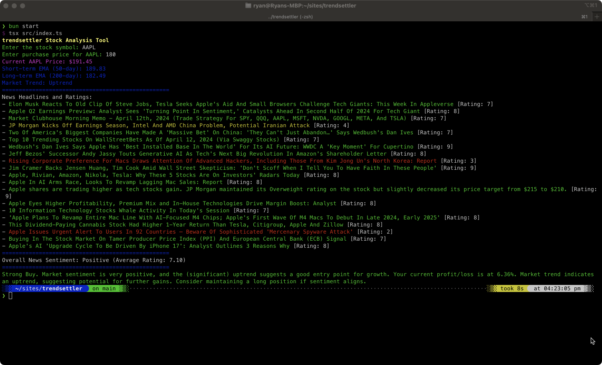

# trendsettler



**trendsettler** is an AI-powered trading and trend analysis tool built on Node.js. It leverages real-time data, sophisticated trend analysis, and sentiment analysis using OpenAI's GPT-3.5 Turbo to provide insights into market trends and help make informed trading decisions.

## Features

- **Real-Time Data Retrieval:** Fetches real-time stock prices and news updates to provide the latest market insights.
- **Sentiment Analysis:** Analyzes the sentiment of financial news headlines using AI, aiding in the understanding of market moods.
- **Trend Analysis:** Calculates Exponential Moving Averages (EMAs) to identify market signals.
- **Decision Making:** Integrates sentiment data with trend analysis to advise on buying, selling, or holding stocks.

## Dependencies

To use **trendsettler**, you need a subscription to Polygon.io's Starter package, which provides access to real-time market data. Ensure you have this subscription and the necessary API keys from [Polygon.io](https://polygon.io/pricing), Benzinga, and OpenAI to fully utilize all features of the tool.

## Installation

First, ensure you have Bun installed on your system. Then run:

```bash
bun install
```

## Environment Variables

Before running the application, you must set up the following environment variables with your respective API keys:

```
OPENAI_API_KEY = "your_openai_api_key"
BENZINGA_API_KEY = "your_benzinga_api_key"
POLYGON_API_KEY = "your_polygon_api_key"
```

Ensure these are added to your environment securely, ideally stored in an .env file or through your hosting provider's environment management system.

## Usage

To start the application, run:

```bash
bun start
```

## License

This project is open source and available under the [MIT License](LICENSE).
